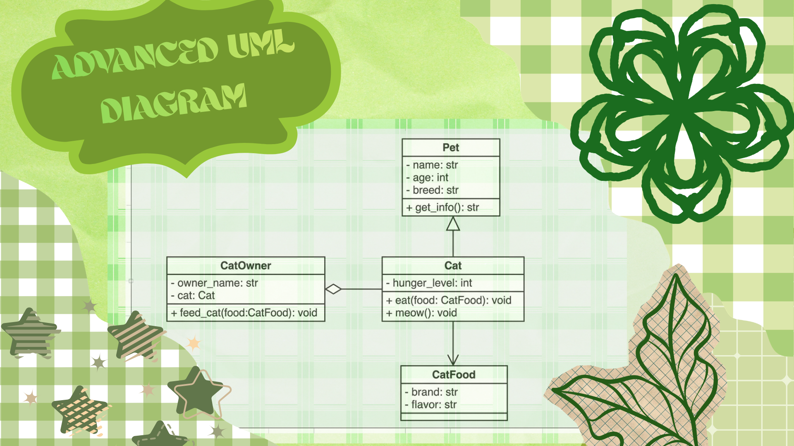
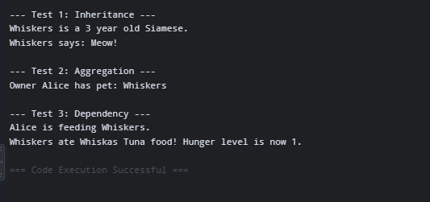
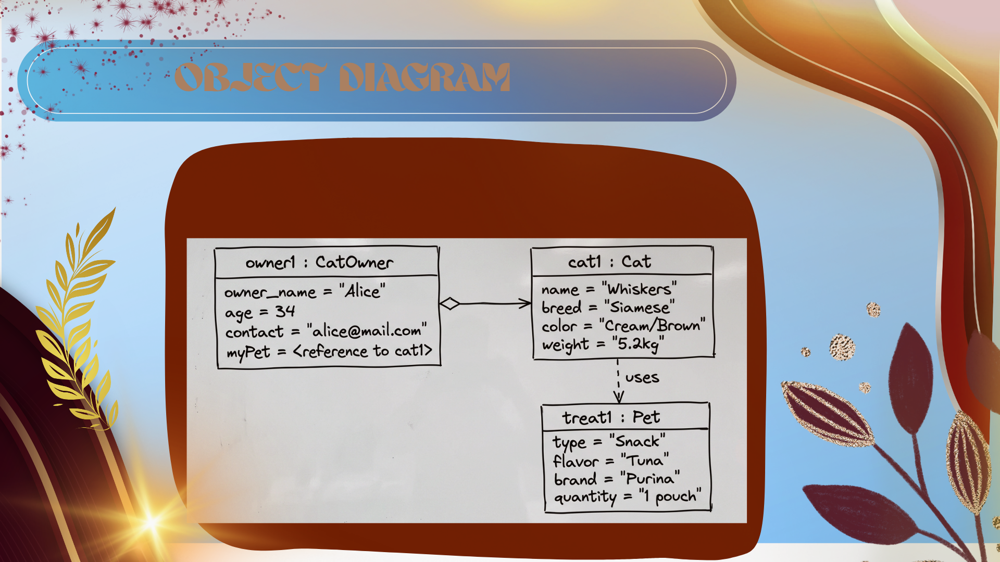

# Advanced Class Relationships
## Previous Activities
[classAttrib](classAttributesMethod.md)

[classRel](classRelationships.md)
## Existing System Description:
## Inheritance Relationship
Parent: Pet

Child: Cat

Explanation: A Cat is a specific type of Pet. The Pet parent class holds general attributes such as name, age, and breed, while the Cat child class inherits these features and adds cat-specific properties like hunger_level and methods like meow.

## Inheritance UML

## Composition/Aggregation
Relationship:
Explanation:
## Advanced UML Diagram

## Python Implementation
[Source Code](advancedRelationships.py)
## Test Run

## Object Diagram

## Reflection
Answers:
