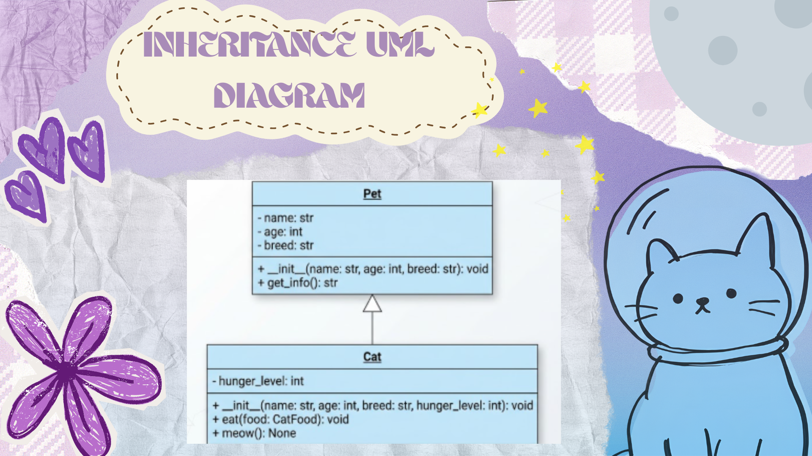

# Advanced Class Relationships
## Previous Activities
[classAttrib](classAttributesMethod.md)

[classRel](classRelationships.md)
## Existing System Description:
## Inheritance Relationship
Parent: Pet

Child: Cat

Explanation: A Cat is a specific type of Pet. The Pet parent class holds general attributes such as name, age, and breed, while the Cat child class inherits these features and adds cat-specific properties like hunger_level and methods like meow.

## Inheritance UML

## Composition/Aggregation
Relationship: Aggregation

Explanation: CatOwner has a weak HAS-A relationship with Cat. The CatOwner class contains a reference to a Cat instance, but the cat can exist independently outside the owner object. If a CatOwner instance is deleted, the Cat object remains active in memory.
## Advanced UML Diagram

## Python Implementation
[Source Code](advancedRelationships.py)

## Test Run

## Object Diagram

## Reflection
Answers:

1.) I chose an inheritance relationship because a cat is fundamentally a specific type of pet. The Cat child class shares core characteristics with the Pet parent class—such as having a name, age, and breed—while extending that behavior with cat-specific traits like a hunger level and meowing. Defining Cat as a subclass of Pet models this natural "is-a" real-world relationship cleanly.

2.) Inheritance eliminated the need to redefine fundamental pet attributes and behavior inside the Cat class. Attributes like name, age, and breed, along with the get_info() method, were defined once in Pet and reused in Cat using super().__init__(). This prevented writing identical setup logic twice across multiple pet types.

3.) The HAS-A relationship between CatOwner and Cat is aggregation because a cat can exist independently of its owner. If the CatOwner object is destroyed or deleted, the Cat object still exists in memory and can be assigned to a different owner. Because the lifecycle of the Cat is not strictly tied to the lifetime of the CatOwner, it represents a weak HAS-A relationship.

4.) Simple association represents a basic, general link between two objects where neither owns or manages the other. In contrast, the aggregation relationship I implemented explicitly defines ownership, where CatOwner holds a reference to a Cat instance as part of its internal state. Additionally, my design incorporates a dependency relationship where Cat relies on CatFood as a parameter inside its methods without storing it permanently.

5.) My design strictly adheres to the DRY (Don't Repeat Yourself) principle by placing shared properties in the Pet parent class rather than duplicating them across subclasses. Method behaviors are centralized so that updates to general pet functionality only need to be made in one location. Additionally, using object references for relationships prevents storing redundant data across classes.
