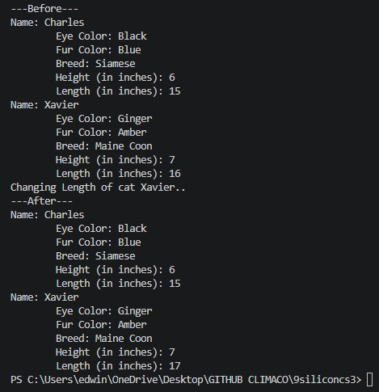
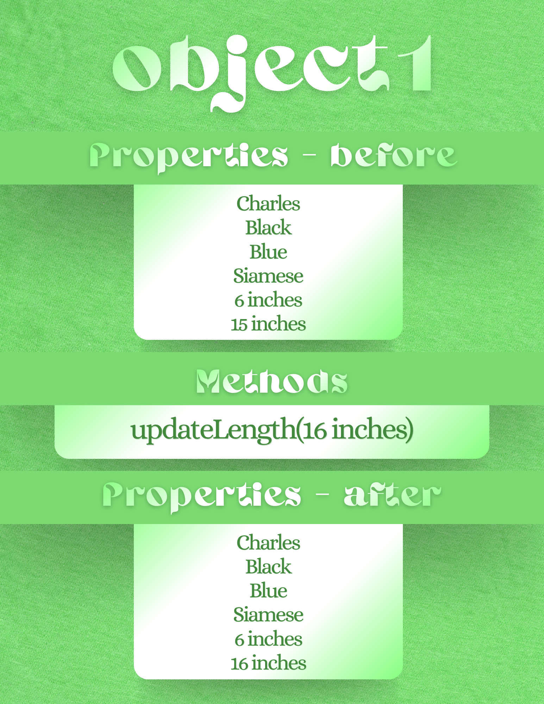

# Class Attributes and Methods
## Previous Design
Link to my previous activity:
[classObjectUML.md](classObjectUML.md)
## Design Revision
I have removed the methods:
- giveCatnip()
- performTrick()
## Visibility Decisions
| Attribute | Data Type | Visibility | Reason |
|---|---|---|---|
| Name | String | Public | This is public so that anyone is able to view the cat's name. |
| FurColor | String | Public | This is public so that anyone is able to view the cat's fur color. |
| EyeColor | String | Public | This is public so that anyone is able to view the cat's eye color. |
| Breed | String | Private | This is private so that only the user is able to identify the cat's breed, reducing risks of catnapping. |
| Height | Integer | Public | This is public so that anyone is able to view the cat's height in inches. |
| Length | Integer | Public | This is public so that anyone is able to view the cat's length in inches. |
## Updated UML Class Diagram

## Python Implementation
[View Python Source](classImplementation.py)
## Test Run

## Object Diagram

## Analysis
### Why did you make your chosen attribute private?
The attribute Breed was chosen to be private to enforce data integrity. A cat's breed is a fundamental characteristic that was established at birth that will never change. Making it private prevents codes or classes from being accidentally modified or overwritten this value after the object is created.
### Which method changes the state of your object?
The state of the object is changed during instantiation via the constructor. It sets the initial state by assigning values to the object's attributes. If your implementation includes setter methods, those would also change the object's state.
### How did your two objects demonstrate that instances are independent?
The two instances demonstrate their independency because they occupy different memory locations and hold completely distinct attribute values despite having the same variables. For example, modifying the Name or Height of teh first cat object does not change the Name or Height of the second cat object. This example proves that each instance maintains its own separate lifecycle and state.
### What is the difference between your class diagram and your object diagram?
Class diagram is the blueprint of the system, showing the data types and names of attributes, and representing abstract relationships between classes. Object diagram is a snapshot of a specific moment, showing the actual values assigned to attributes, and representing concrete relationships between instances.
