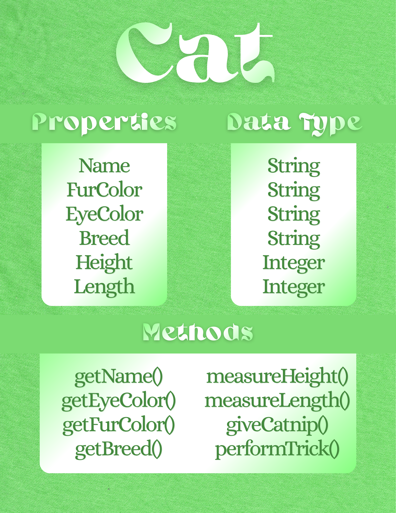

# SG4 - Understanding Classes and Objects
## Cat
## This class represents a real-world cat, showing its fur color, eye color, breed, height, and length.
## Properties
| Property | Data Type | Description |
|---|---|---|
| Name | String | The name of the cat. |
| FurColor | String | The fur color of the cat. |
| EyeColor | String | The eye color of the cat. |
| Breed | String | The breed of the cat. |
| Height | Integer | The height of the cat. |
| Length | Integer | The length of the cat. |
## Methods
| Method | Description |
|---|---|
| getName() | This method gets the name of the cat. |
| getEyeColor() | This method gets the eye color of the cat. |
| getFurColor() | This method gets the fur color of the cat. |
| getBreed() | This method gets the breed of the cat. |
| measureHeight() | This method measures the height of the cat. |
| measureLength() | This method measures the length of the cat. |
| giveCatnip() | This method gives the cat catnip. |
| performTrick() | This method makes the cat perform a trick. |
## Class Diagram

## Design Explanation
### Why did you choose this class? 
### Which property is the most important? Why?
### Which method is the most useful? Why?
