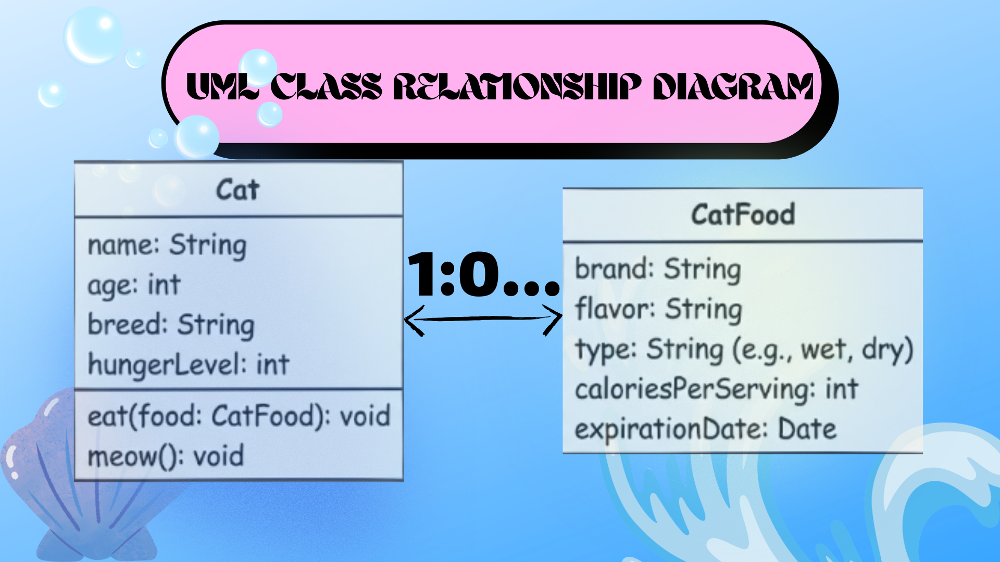
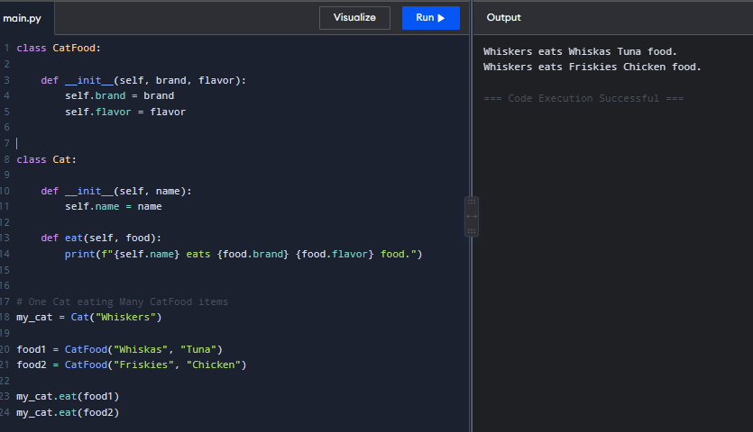
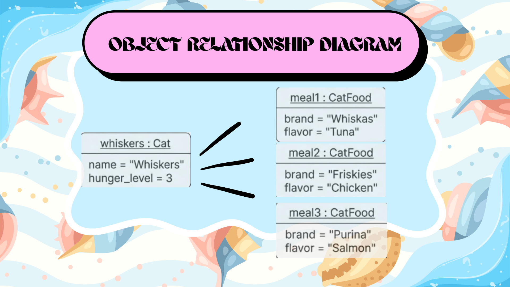

# Class Relationships: Association and Multiplicity
## Previous Work
[Part I - Classes and Objects](classObjectUML.md)

[Part II - Class Attributes and Methods](https://github.com/jfmclimaco-a11y/9siliconcs3/blob/main/q1/ctskillsSiliconJebFrancisM.Climaco/classAttributesMethod.md)

## Existing Class
Class:Cat

Description: A carnivore often kept as a pet by humans.

## New Related Class
Class: Cat Food
Description: food made specifically for cats to eat

## Association
Relationship: A Cat eats CatFood.
Explanation: A Cat has a uses-a relationship with CatFood, where the cat consumes the food to perform an action.
## Multiplicity

Multiplicity: 1 : Many
Explanation: One cat can eat many different servings of cat food over time, but each individual serving of food is eaten by only one specific cat.
## UML Class Relationship Diagram

## Python Implementation
[View Python Source](classRelationships.py)
## Test Run

## Object Relationship Diagram

## Analysis
### What is the association between your two classes?
### What multiplicity did you choose and why?
### How did you implement the relationship in Python?
### Why did you store an object reference instead of copying its data?
### If your relationship uses many, why is a list appropriate?
